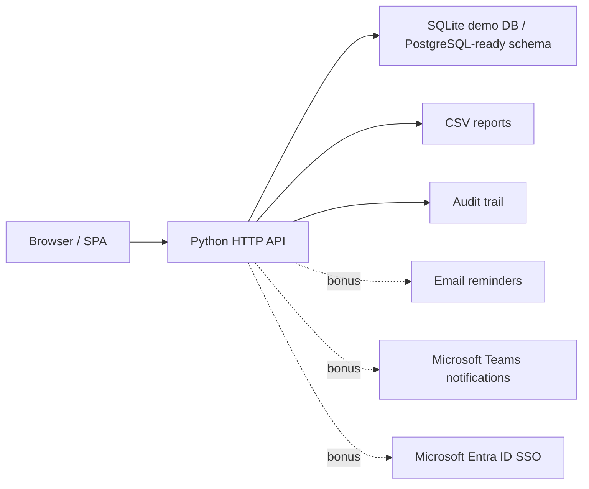

# Architecture

## Runtime

- `public/` contains the single-page web UI.
- `app/server.py` serves static assets and JSON API endpoints.
- `app/storage.py` owns persistence, seed data, and workflow queries.
- `app/business.py` contains validation and progress-scoring rules.

The MVP uses SQLite to keep local demo setup simple. The schema intentionally uses relational tables and JSON audit snapshots so it can be moved to PostgreSQL with minimal model changes.

## Data Flow

1. Employee creates goals in draft state.
2. Backend validates goal count, individual weightage, UoM target shape, and total `100%` weightage on submission.
3. Manager reviews submitted sheets, optionally edits target or weightage, then approves or returns for rework.
4. Approval moves the sheet to `locked`, and goal rows become read-only for the employee.
5. Employee quarterly progress updates create progress rows and calculated scores.
6. Manager check-ins attach structured feedback to the sheet and quarter.
7. Admin/HR can create shared goals, unlock exceptions, export reports, and inspect audit logs.

## Production Upgrade Path

- Replace SQLite with PostgreSQL using the same relational shape.
- Split static hosting and API hosting across Vercel and Render/Railway.
- Add Alembic migrations once the schema stabilizes.
- Swap the local JWT login for Microsoft Entra ID OIDC.
- Move reminders and escalations into a scheduled background worker.
