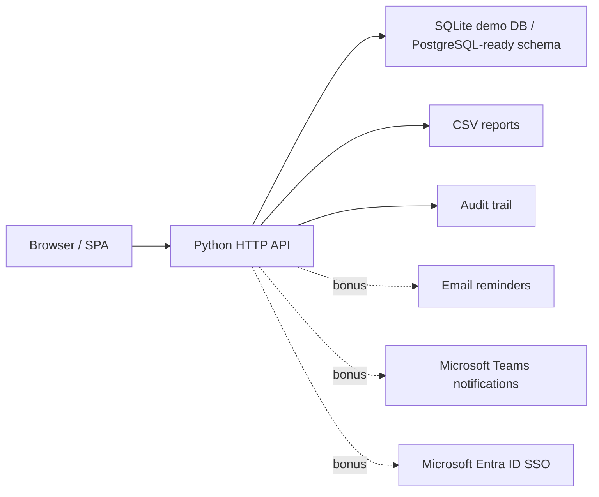

# Architecture

## Runtime

- `public/` contains the single-page web UI.
- `app/server.py` serves static assets and JSON API endpoints.
- `app/storage.py` owns persistence, seed data, and workflow queries.
- `app/business.py` contains validation and progress-scoring rules.

The MVP uses SQLite to keep local demo setup simple. The schema intentionally uses relational tables and JSON audit snapshots so it can be moved to PostgreSQL with minimal model changes.

